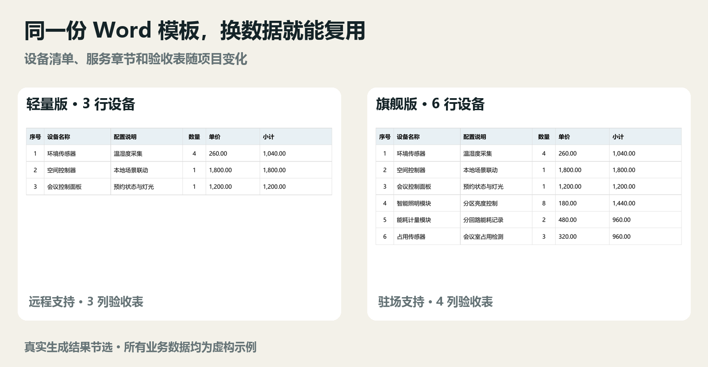

# Wordfill Toolkit

Word 模板与 Skill 工具包

在 Word 模板中写入 `{{字段}}`，用 JSON 数据生成文档；也可以为每个字段编写填写说明，将模板、规则和填充引擎打包成专用 Skill。

适用于合同、技术方案、字段清单、改造清单等需要重复填写的文档。支持条件内容、循环表格行、动态表格、图片、金额日期格式和多行文本。

## 视频教程与快速体验

**[▶ 在 Bilibili 看完整使用教程](https://www.bilibili.com/video/BV1xNhX6BEFL/)** · **[新手跟做与常见问题](docs/快速上手.md)** · **[下载源码 ZIP](https://github.com/edragnemey/wordfill-toolkit/archive/refs/heads/main.zip)**

教程演示从选择 Word 模板、加载 JSON、生成两份方案，到编写字段规则、生成专属 Skill。配套输入文件在 [智能办公空间示例](工具-Word模板编译器/示例/智能办公空间/)。

> 教程勘误：约 01:11 处画面中的“图片路径相对数据文件”应为“图片路径相对 **Word 模板所在目录**”。生成 Skill 后，配套模板位于 `assets/`，使用相对路径的图片也需放在对应位置，或使用绝对路径。详见[图片路径说明](docs/快速上手.md#图片找不到怎么办)。



*真实生成结果节选，示例数据均为虚构。完整方案还展示条件章节、动态验收表、图片和金额格式。*

这个工具主要解决“换一个项目，又要改名字、补表格、复制章节”的重复操作：模板保留固定版式，JSON 提供变化内容，Skill 保存填写规则。第一次需要准备字段标记与规则，生成后仍需核对内容和分页。

| 你想做什么 | 从哪里开始 |
| --- | --- |
| 先看实际效果 | [运行智能办公空间示例](工具-Word模板编译器/示例/智能办公空间/README.md) |
| 用 JSON 生成 Word | `工具-Word模板编译器/一键启动.bat`（Windows） |
| 把模板做成专属 Skill | 项目根目录的 `启动填写界面.bat`（Windows） |
| 学习模板语法 | [字段、循环、条件与图片说明](工具-Word模板编译器/README.md) |

## 目录

```text
.
├─ README.md
├─ .gitignore
├─ 启动填写界面.bat               Windows：打开字段说明与 Skill 生成界面
├─ 启动填写界面.command           macOS：启动入口
├─ 工具-Word模板编译器/
│  ├─ README.md                   字段语法与命令行说明
│  ├─ start_tool.py               Word 填充图形界面入口
│  ├─ wordfill/                   填充引擎、命令行与界面
│  ├─ 示例/                      输入模板、配套 JSON 与图片
│  └─ 自测/自测.py                可重复运行的功能检查
└─ skills/
   ├─ wordfill/                   通用 Word 填充 Skill
   ├─ json-skill-builder/         专用 Skill 生成器
   └─ tech-solution-json/         技术方案示例 Skill
```

## 运行环境

- Python 3.10 或更高版本。
- 在项目根目录安装依赖：`python -m pip install -r requirements.txt`。
- 图形界面需要 Tkinter。若当前 Python 未提供 Tkinter，请安装与该 Python 匹配的 Tk 支持。
- 导出 PDF 需要本机安装 LibreOffice；仅生成 DOCX 不需要。

Windows 安装 Python 时应勾选加入 PATH。macOS/Linux 下若使用 `python3`，将下文命令中的 `python` 替换为 `python3`。

## 用 JSON 填充 Word

1. Windows 双击 `工具-Word模板编译器/一键启动.bat`；macOS 可运行对应目录中的 `启动工具.command`。
2. 选择 Word 模板，点击“生成数据模板”，填写生成的 JSON。
3. 选择填写好的 JSON，点击“开始生成文档”。

也可以从项目根目录启动：

```bash
python "工具-Word模板编译器/start_tool.py"
```

运行综合功能演示，用同一份模板生成轻量版和旗舰版交付方案：

```bash
python "工具-Word模板编译器/示例/智能办公空间/生成演示.py"
```

结果写入 `output/智能办公空间/`。两份方案展示设备行数、条件章节、验收表格列数与行数的变化，还包含图片、预算格式、默认值和多行配置。所有业务数据均为虚构。

查看 [演示说明与功能对照](工具-Word模板编译器/示例/智能办公空间/README.md)，或阅读 [Word 模板编译器完整语法](工具-Word模板编译器/README.md)。

## 生成专用 Skill

1. Windows 双击项目根目录的 `启动填写界面.bat`；macOS 可运行 `启动填写界面.command`。
2. 点击“从 Word 模板生成骨架”，选择包含字段标记的 DOCX。
3. 为各字段填写内容要求；表格字段可填写整表及各列说明。
4. 填写 Skill 名称，按需要选择 ZIP 打包，生成 Skill。

跨平台命令行启动方式：

```bash
python skills/json-skill-builder/scripts/skill_builder_gui.py
```

生成器默认输出到用户目录下的 `.codex/skills/`。示例 Skill 及通用 Skill 的使用说明分别位于各目录的 `SKILL.md`。每个 Skill 自带运行所需的引擎与资源，因此源码中保留了相应副本。

生成目录与客户端的 Skill 发现目录可能不同。安装时请复制完整 Skill 文件夹，并按[安装与调用说明](docs/快速上手.md#安装并调用-skill)检查实际路径。外部图片不会因选中 Word 模板而自动打包，需要另行准备。

检查随附技术方案 Skill 的运行环境：

```bash
python skills/tech-solution-json/scripts/env_check.py
```

## 开发检查与文件管理

从项目根目录运行功能检查：

```bash
python "工具-Word模板编译器/自测/自测.py"
```

测试会自动创建 `自测/_临时/`，该目录已被 Git 忽略。保留测试脚本，便于修改代码后检查基础功能。

源码目录不附带预生成的 Word/PDF 成品、ZIP 分发包或 Python 缓存。输入模板、配套 JSON 和图片保留，用于重现示例。

建议将个人数据放入根目录的 `local/`，文档输出放入 `output/`；这两个目录已被 Git 忽略。其他位置的新文件仍需在提交前检查。

## 反馈问题与参与改进

遇到问题可[提交 Issue](https://github.com/edragnemey/wordfill-toolkit/issues/new?template=bug_report.md)，说明操作系统、Python 版本、操作步骤、预期结果和报错信息。需要附模板或数据时，请先替换真实姓名、客户信息及其他敏感内容。也欢迎通过 Issue 提出使用场景，或提交 Pull Request 改进文档与代码。

## 许可证

本项目采用 [MIT 许可证](LICENSE)。第三方依赖遵循各自的许可证。
